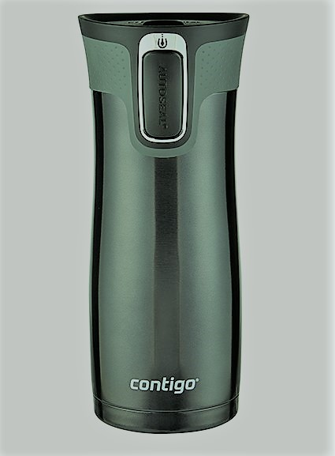

# Since THERMOS is no longer being developed- and servers are reduced to using Sponge for 1.8+, this project is dedicated to renewing the ability for Minecraft servers to use native bukkit plugins along with Forge mods.

# Contigo

<!---  --->

![Minecraft Forge v10.13.4.1614][forge]
![Minecraft v1.7.10][mc]
![Java JDK v1.8][java]
![Spigot 1.7.10 Snapshot ][spigot]

### What's Contigo?
Contigo is a fork of Thermos, a craftbukkit forge server for Minecraft 1.7.10. After Thermos was discontinued, Contigo was created to allow active members of the Minecraft coding community to optimize it and provide fixes in a timely manner.

We hope to eliminate all issues with craftbukkit forge servers. In the end, we envision a seamless, low lag Contigo experience with support for new 1.8+ versions of Minecraft.

Advantages over KCauldron:
+ Lag-lowering optimizations
+ Better world protection (Forge stuff doesn't bypass Bukkit plugins!)
+ Many patches that KCauldron didn't get from Spigot
+ Dupe glitch fixes

## Installation
Click [here](http://cyberdynecc.github.io/Thermos/install)

<!--- ### Downloads
#You can download the pre-built packages from [here](https://github.com/CyberdyneCC/Thermos/releases). 
--->
**Contigo is still in early alpha and you may encounter issues in using it with your server. You have been warned!**

P.S. **PLEASE** look at the release notes before downloading! :smile:

##Installing WarmRoast
[Tutorial Video](https://youtu.be/c0ffjooX7Jw)

## Chat

Feel free to drop in on the Contigo Discord chat [here](https://discord.gg/cNpacKk)

## Contributing

Please read the [guide](https://github.com/djoveryde/Contigo/blob/master/CONTRIBUTING.md) on how to contribute - Contigo always needs improvements :smile: 

## Build Requirements
* Java 8u101 JDK or higher
* `JAVA_HOME` defined on your OS

## Building djoveryde/Contigo
* Checkout project
  * You can use IDE or clone from console:
  `git clone https://github.com/djoveryde/Contigo.git`
* Setup
  * Auto: `setup.sh`
  * Manual:
  `git submodule update --init --recursive`
* Build
  * This process downloads minecraft and apply patches
  * If you have gradle integration in IDE - you can still use gui
  * Auto: `build.sh`
  * Manual:
  `./gradlew setupCauldron jar`

All builds will be in `build/distributions`
  
## Updating sources
* Update sources
  * `git pull origin master`
* Re apply patches & build binaries
  * `./gradlew clean setupCauldron jar`

## Known Caveats, use provided fixes at your own risk.

✔ BungeeCord: It's been known for years that BungeeCord barely works with Forge & seems that it'll never be supported officially. [Fixed]

✔ BuyCraftX: Doesn't seem to work with Thermos, info on why it doesn't is unknown currently. [Fixed]

✔ Citizens: Not compatible with forge [Fixed]

✖ Lilypad: 100% not compatible with Forge, lead developer has declined to add support when asked.

✔ Mobius / Opis: You can download fixed version [HERE](https://cdn.discordapp.com/attachments/172072987154055168/186577486593785857/MobiusCore-1.2.5-Thermos.jar)

✔ SkinsRestorer: Latest working version is 10.4.4

[Fixed]: http://gogs.tcpr.ca/TCPR/Fixes "Fixed"
[forge]: https://img.shields.io/badge/Minecraft%20Forge-v10.13.4.1614-green.svg "Minecraft Forge v10.13.4.1614"
[mc]: https://img.shields.io/badge/Minecraft-v1.7.10-green.svg "Minecraft 1.7.10"
[java]: https://img.shields.io/badge/Java%20JDK-v1.8-blue.svg "Java JDK 8"
[spigot]: https://img.shields.io/badge/Spigot-v1.7.10--R0.1--SNAPSHOT-lightgrey.svg "Spigot R0.1 Snapshot"
